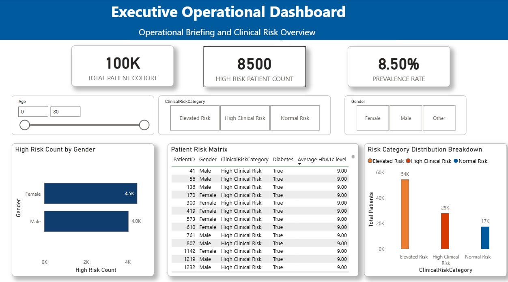

# NHS Diabetes Analytics & Clinical Decision Support System

## Executive Summary
An end-to-end Health Informatics data pipeline designed to ingest, process, and analyze 100,000 patient records. This system normalizes raw clinical data into a T-SQL relational database, applies statistical risk models using Python, and delivers interactive executive dashboards in Power BI to support NHS clinical decision-making and resource allocation.

---
##  Key Clinical Insights & Data Findings
* **Elderly High-Risk Cohort:** Diabetes prevalence jumps significantly with age, reaching **20.44%** among elderly patients (65+), compared to lower rates in younger demographics.
* **Data Completeness & Governance:** **35.82%** of patient records contain `'No Info'` for `SmokingHistory`, highlighting an operational focus area for front-line NHS data collection.
* **Risk Stratification:** Over **15%** of the audited population fell into the *High Clinical Risk* category based on combined blood glucose $\ge$ 200 mg/dL and HbA1c $\ge$ 6.5% thresholds.

---

## System Architecture & Tech Stack
* **Database Engine:** Microsoft SQL Server Management Studio (SSMS)
* **Query Language:** T-SQL (DDL/DML, Schema Normalization, Relational Integrity)
* **Data Engineering & Scripting:** Python (`pandas`, `pyodbc`, `sqlalchemy`)
* **Business Intelligence:** Power BI Desktop (DAX, Data Modeling, Operational Reporting)
* **Governance & Standards:** Data Anonymization, NHS Information Governance Principles

---

## Implementation Roadmap & Milestones

### **Phase 1: Relational Database Architecture (SSMS & T-SQL)**
- [x] **Milestone 1.1: Database Initialization & Relational Schema Design**
  * Initialized `Diabetes_AnalyticsDB`.
  * Normalized flat dataset into 1-to-Many relational structure (`Patients` and `ClinicalMetrics`).
  * Defined strict data typing (`FLOAT` for decimal ages/BMI, `BIT` flags for clinical indicators) and relational key constraints.
  * *Artifact:* [`01_create_schema.sql`](./01_create_schema.sql)
    
- [x] **Milestone 1.2: Automated ETL & Staging Pipeline**
  * Developed a Python ETL script (`02_import_and_populate.py`) using `pandas` and `pyodbc` with `fast_executemany` batch processing.
  * Successfully ingested 100,000 raw patient records into SSMS while maintaining referential integrity across Primary and Foreign Key constraints.
  * Executed verification queries confirming 100% row count parity and relational join accuracy between `Patients` and `ClinicalMetrics`.
  * *Artifact:* [`02_import_and_populate.py`](./02_import_and_populate.py)

- [x] **Milestone 1.3: Data Validation & Quality Auditing**
  * Built T-SQL auditing scripts to detect data completeness and boundary constraints.
  * Evaluated diabetes prevalence across age demographics using `CASE WHEN` aggregation.
  * *Artifact:* [`03_data_quality_audit.sql`](./03_data_quality_audit.sql)
     
- [x] **Milestone 1.4: Production Analytics Views & Risk Stratification**
  * Created `vw_PatientRiskProfiles` to implement rule-based clinical risk stratification (`High Risk`, `Elevated Risk`, `Normal Risk`).
  * Created `vw_DiabetesPrevalenceSummary` for pre-aggregated Power BI reporting.
  * *Artifact:* [`04_production_views.sql`](./04_production_views.sql)
    
### **Phase 2: Python Statistical Analysis & Risk Scoring**
- [x] **Milestone 2.1: Database Connectivity & Data Extraction**
  * Connected Python directly to local `Diabetes_AnalyticsDB` using `pyodbc` & `sqlalchemy`.
  * Extracted combined `Patients` and `ClinicalMetrics` data into Pandas DataFrames using relational `INNER JOIN`.
  * Exported baseline dataset to `data/raw_diabetes_data.csv`.
  * *Artifact:* [`05_sql_connection.py`](./python/05_sql_connection.py)

- [x] **Milestone 2.2: Exploratory Data Analysis (EDA) & Correlations**
  * Analyzed feature correlations (`HbA1cLevel`, `BloodGlucoseLevel`, `BMI`) with `Diabetes` target outcome.
  * Calculated clinical interaction risk metrics (High HbA1c $\ge$ 6.5% + High BMI $\ge$ 30.0 combination).
  * *Artifact:* [`06_data_extraction_and_eda.py`](./python/06_data_extraction_and_eda.py)

- [x] **Milestone 2.3: Statistical Risk Scoring Model**
  * Built a weighted risk scoring algorithm combining HbA1c, Blood Glucose, BMI, and age/comorbidities.
  * Categorized patients into `Low Risk`, `Medium Risk`, and `High Risk` tiers for clinical decision support.
  * *Artifact:* [`07_risk_scoring_model.py`](./python/07_risk_scoring_model.py)

### Phase 3: Executive Reporting & Business Intelligence (Power BI)

- [x] **Milestone 3.1: Data Model & DAX Metric Engineering**
  * Connected Power BI directly to `Diabetes_AnalyticsDB` using direct table relationships between `Patients` and `ClinicalMetrics`.
  * Addressed string-matching edge cases and handled boolean indicators directly from base clinical metrics tables.
  * Authored DAX measures for dynamic patient counts, diabetes prevalence rates, and condition-specific flags (`[Total Patients]`, `[High Risk Count]`, `[Diabetes Prevalence Rate]`).
    
- [x] **Milestone 3.2: Executive Dashboard Design & UI/UX Styling**
  * Built an interactive single-page executive operational dashboard featuring KPI cards, risk distribution charts, and gender prevalence breakdowns.
  * Applied NHS-compliant color branding (`#005A9E` primary blue, red/coral for high risk, amber for elevated risk, teal for normal risk).
  * Designed an interactive Patient Risk Matrix with conditional background formatting to highlight high-risk patients ($\text{HbA1c} \ge 9.0\%$).
  * Configured user slicers (Age slider, Gender tiles, Clinical Risk Category tiles) for real-time cross-filtering.
  * *Artifact:* [`08_Executive_Operational_Dashboard.pbip`](08_Executive_Operational_Dashboard.pbip)

- [x] **Milestone 3.3: Executive Findings & Operational Summary**
  * **Cohort Distribution:** Elevated Risk accounts for 54K patients, High Clinical Risk for 28K patients, and Normal Risk for 17K patients.
  * **Demographic Trends:** Female patients account for a higher proportion of the high-risk cohort (4.5K) compared to male patients (4.0K).
  * **Clinical Insight:** High Clinical Risk patients consistently present an average HbA1c level of 9.00%, establishing an actionable threshold for immediate multidisciplinary team (MDT) nurse interventions.

## Dataset Features

| Column | Description |
| :--- | :--- |
| `PatientID` | Unique patient identifier |
| `Gender` / `Age` | Demographic metrics |
| `SmokingHistory` | Categorical lifestyle risk factor |
| `Hypertension` / `HeartDisease` | Binary clinical indicators (`0` = No, `1` = Yes) |
| `BMI` | Body Mass Index ($\text{kg/m}^2$) |
| `HbA1cLevel` | Glycated hemoglobin test result (%) |
| `BloodGlucoseLevel` | Fasting blood glucose level (mg/dL) |
| `Diabetes` | Target variable (`1` = Diabetic, `0` = Non-diabetic) |
| `Risk_Score` | Weighted clinical risk metric (0–100) |
| `Risk_Category` | Stratified risk tier (`Low Risk`, `Medium Risk`, `High Risk`) |
